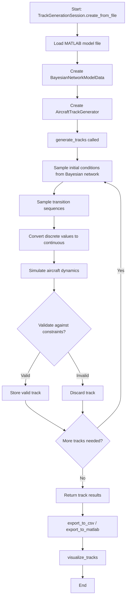
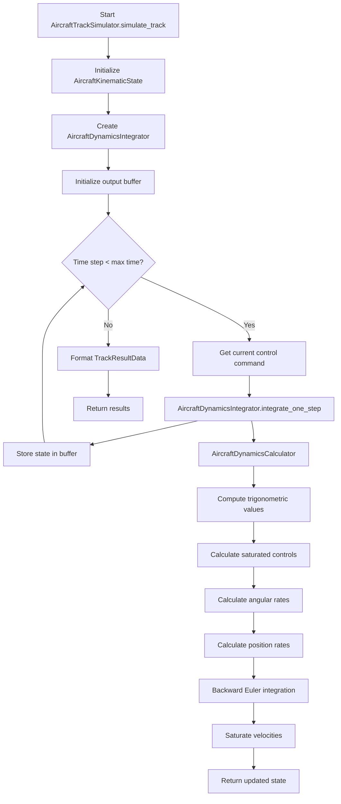
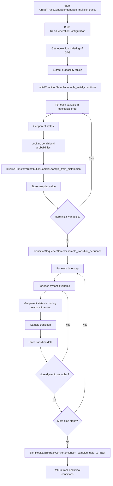

# Track Generation Tool Documentation

## Overview

The `track_generation_tool.py` is a Python module designed for generating realistic aircraft flight tracks using Bayesian network models trained on aviation data. The tool simulates aircraft dynamics based on sampled initial conditions and transition sequences from probabilistic models stored in MATLAB (.mat) files.

The module follows SOLID and DRY principles with comprehensive type hints and is designed for maintainability and extensibility.

## Key Components

### Dependencies

- `networkx`: For graph operations on Bayesian networks
- `pandas`: Data manipulation and analysis
- `numpy`: Numerical computations
- `scipy`: Loading MATLAB files and scientific computing
- `matplotlib`: 3D plotting of flight tracks
- `importlib.resources`: Accessing packaged data files

### Data Sources

The tool uses Bayesian network models stored in `.mat` files containing:

- DAG structures for initial and transition probabilities
- Probability tables (`N_initial`, `N_transition`)
- Cut points for discretization
- Resampling rates

## Architecture

### Design Principles

The module follows SOLID principles:

- **Single Responsibility Principle**: Each class has one purpose (e.g., `AircraftDynamicsCalculator`, `CsvTrackResultExporter`)
- **Open/Closed Principle**: Exporters and validators use abstract base classes for extensibility
- **Liskov Substitution Principle**: All exporters can be used interchangeably through `TrackResultExporterInterface`
- **Interface Segregation Principle**: Protocols define minimal required interfaces
- **Dependency Inversion Principle**: High-level modules depend on abstractions, not concrete implementations

### Constants Classes

| Class | Purpose |
|-------|---------|
| `UnitConversionConstants` | Physical unit conversion factors (knots to ft/s, etc.) |
| `PhysicsConstants` | Gravitational acceleration, time step, integration gain |
| `AircraftPerformanceLimits` | Maximum bank angle, roll rate, velocity limits |
| `StatisticalThresholds` | Percentile thresholds for distribution calculations |
| `FileExportLimits` | Maximum CSV rows per file (1,000,000) |

### Core Data Classes

| Class | Purpose |
|-------|---------|
| `VelocityLimits` | Min/max velocity constraints with clamping |
| `VerticalRateLimits` | Min/max vertical rate constraints |
| `AngularRateLimits` | Maximum pitch and yaw rates |
| `DynamicPerformanceLimits` | Combined performance limits container |
| `AltitudeBoundary` | Altitude validation boundaries |
| `TrigonometricStateValues` | Cached trigonometric calculations |
| `AircraftKinematicState` | Complete aircraft state at a point in time |
| `SimulationControlParameters` | Dynamics simulation control parameters |
| `BayesianNetworkModelData` | Container for loaded MATLAB model data |
| `TrackGenerationConfiguration` | Configuration for track generation |

### Type Definitions

```python
class TrackResultData(TypedDict):
    """Track simulation results with all spatial units in feet."""
    time: NDArray[np.floating[Any]]
    north_position_feet: NDArray[np.floating[Any]]
    east_position_feet: NDArray[np.floating[Any]]
    altitude_feet: NDArray[np.floating[Any]]
    speed_feet_per_second: NDArray[np.floating[Any]]
    bank_angle_radians: NDArray[np.floating[Any]]
    pitch_angle_radians: NDArray[np.floating[Any]]
    heading_angle_radians: NDArray[np.floating[Any]]
```

## Primary API

### TrackGenerationSession

The main interface for track generation, replacing global state management.

```python
@dataclass
class TrackGenerationSession:
    """Encapsulates a track generation session."""

    model_data: BayesianNetworkModelData
    model_name: str
    generator: AircraftTrackGenerator
    generated_tracks: list[TrackResultData]
    initial_conditions: pd.DataFrame | None
    transition_data: list[list[list[float]]]
```

#### Methods

##### `create_from_file(filepath: str | Path) -> TrackGenerationSession | None`

Create a session from a MATLAB model file.

```python
session = TrackGenerationSession.create_from_file("Light_Aircraft_Below_10000_ft_Data.mat")
```

##### `generate_tracks(number_of_tracks, simulation_duration_seconds, use_reproducible_seed) -> list[TrackResultData]`

Generate tracks and store results in session.

```python
tracks = session.generate_tracks(
    number_of_tracks=10,
    simulation_duration_seconds=250,
    use_reproducible_seed=False
)
```

##### `export_to_csv(output_filename_base: str | None = None) -> list[Path]`

Export tracks to CSV format (auto-saves to `output/` directory with unique filename).

##### `export_to_matlab(output_filename_base: str | None = None) -> Path | None`

Export tracks to MATLAB format (auto-saves to `output/` directory with unique filename).

##### `visualize_tracks(plot_title, output_filepath, save_to_file) -> Path | None`

Visualize tracks in 3D. By default saves to file; set `save_to_file=False` to display interactively.

### Standalone Functions

#### `generate_aircraft_tracks(model_filepath, simulation_duration_seconds, number_of_tracks, use_reproducible_seed)`

Main entry point for track generation.

**Parameters:**

- `model_filepath`: Path to MATLAB model file or model name
- `simulation_duration_seconds`: Track duration in seconds
- `number_of_tracks`: Number of tracks to generate
- `use_reproducible_seed`: Enable seeded generation for reproducibility

**Returns:** `tuple[list[TrackResultData], TrackGenerationSession] | None`

#### `get_available_model_files() -> list[str]`

Returns list of available MATLAB model files in the package data directory.

#### `load_bayesian_network_model_from_file(filepath) -> BayesianNetworkModelData | None`

Load a Bayesian network model from a MATLAB file.

#### `generate_unique_filepath(output_directory, base_name, extension) -> Path`

Generate a unique filepath by appending a number if file exists.

### Exporters

#### CsvTrackResultExporter

Exports track results to CSV format with automatic file splitting.

```python
exporter = CsvTrackResultExporter(maximum_rows_per_file=1_000_000)
paths = exporter.export_tracks(track_results, "output_name")
# Saves to: output/output_name_Result.csv (or _1.csv, _2.csv if exists)
```

#### MatlabTrackResultExporter

Exports track results to MATLAB .mat format.

```python
exporter = MatlabTrackResultExporter()
path = exporter.export_tracks(track_results, "output_name")
# Saves to: output/output_name_Result.mat
```

### Visualization

#### TrackVisualizationRenderer

Creates 3D visualizations of generated aircraft tracks.

```python
# Save to file (auto-generates unique filename)
path = TrackVisualizationRenderer.render_three_dimensional_tracks(
    track_results,
    plot_title="Light Aircraft Tracks",
    output_filename_base="light_aircraft"
)

# Display interactively
TrackVisualizationRenderer.render_three_dimensional_tracks(
    track_results,
    plot_title="Light Aircraft Tracks"
)
```

## Output Directory

All output files are automatically saved to the `output/` directory (configurable via `DEFAULT_OUTPUT_DIRECTORY`). Files are never overwritten; instead, a numeric suffix is appended to create unique filenames:

- `output/Model_Name_Result.csv`
- `output/Model_Name_Result_1.csv`
- `output/Model_Name_Result_2.csv`
- etc.

## Sampling Functions

#### `calculate_conditional_probability_table_index(parent_variable_sizes, parent_variable_values) -> int`

Calculates the linear index for conditional probability tables based on parent variable states.

#### `InverseTransformDistributionSampler.sample_from_distribution(probability_weights) -> int`

Samples from a discrete probability distribution using inverse transform sampling.

#### `convert_discrete_bin_to_continuous_value(bin_edge_boundaries, discrete_bin_index) -> float`

Converts discretized bin index back to continuous value using uniform sampling within bin.

## Dynamics Integration

### AircraftDynamicsCalculator

Calculates aircraft dynamics components for integration using backwards Euler method.

### AircraftDynamicsIntegrator

Performs time-stepping integration of aircraft dynamics.

### AircraftTrackSimulator

Orchestrates the complete track simulation from initial conditions through control commands.

## Validation

### ConstraintBasedTrackValidator

Validates generated tracks against altitude and velocity constraints.

```python
validator = ConstraintBasedTrackValidator(altitude_boundary, velocity_limits)
is_valid = validator.validate_track(track_result)
```

## Workflow Diagrams

### Main Track Generation Process



### Aircraft Dynamics Simulation



### Bayesian Network Sampling



## Data Flow

1. **Input**: MATLAB file containing Bayesian network model
2. **Model Loading**:
   - `load_bayesian_network_model_from_file` loads MATLAB data
   - `BayesianNetworkModelData.from_matlab_dictionary` parses structure
3. **Configuration**:
   - `TrackGenerationConfigurationBuilder` creates configuration
   - Extracts DAG topology, probability tables, discretization boundaries
4. **Sampling**:
   - `InitialConditionSampler` samples initial aircraft state
   - `TransitionSequenceSampler` samples time-series transitions
5. **Conversion**:
   - `SampledDataToTrackConverter` converts discrete to continuous values
   - Unit conversions applied (knots to ft/s, etc.)
6. **Simulation**:
   - `AircraftTrackSimulator` integrates dynamics
   - `AircraftDynamicsIntegrator` performs Euler integration
7. **Validation**:
   - `ConstraintBasedTrackValidator` validates against limits
8. **Output**:
   - `CsvTrackResultExporter` or `MatlabTrackResultExporter` saves files
   - `TrackVisualizationRenderer` creates 3D plots

## Validation and Constraints

Tracks are validated against:

- **Altitude limits**: Min/max from model plus 500 ft margin
- **Velocity limits**: Calculated from 1st and 99th percentiles of probability distributions
- **Vertical rate limits**: From model constraints
- **Aircraft-specific constraints**: Rotorcraft vs fixed-wing handling

Invalid tracks are discarded and new samples are generated until the required number of valid tracks is obtained.

## Usage Examples

### Modern API (Recommended)

```python
from cam_track_gen import TrackGenerationSession, get_available_model_files

# List available models
models = get_available_model_files()
print(f"Available models: {models}")

# Create session and generate tracks
session = TrackGenerationSession.create_from_file("Light_Aircraft_Below_10000_ft_Data.mat")
tracks = session.generate_tracks(
    number_of_tracks=10,
    simulation_duration_seconds=250,
    use_reproducible_seed=False
)

# Export results (auto-saves to output/ with unique filenames)
session.export_to_matlab()
session.export_to_csv()
session.visualize_tracks()  # Saves to file by default
```

### Direct Component Usage

```python
from cam_track_gen import (
    AircraftTrackGenerator,
    CsvTrackResultExporter,
    MatlabTrackResultExporter,
    TrackVisualizationRenderer,
    load_bayesian_network_model_from_file,
)

# Load model
model_data = load_bayesian_network_model_from_file("Helicopter_Below_10000_ft_Data.mat")

# Create generator and generate tracks
generator = AircraftTrackGenerator(model_data)
tracks, initial_conditions, transitions = generator.generate_multiple_tracks(
    number_of_tracks=5,
    simulation_duration_seconds=120,
    use_reproducible_seed=True
)

# Export with custom settings
csv_exporter = CsvTrackResultExporter(maximum_rows_per_file=500_000)
csv_exporter.export_tracks(tracks, "helicopter_tracks")

# Visualize
TrackVisualizationRenderer.render_three_dimensional_tracks(
    tracks,
    plot_title="Helicopter Tracks",
    output_filename_base="helicopter_visualization"
)
```

### Legacy API (Deprecated)

```python
from cam_track_gen import gen_track, generate_plot, save_as_matlab, save_to_csv

# Generate tracks using legacy interface
results = gen_track("Light_Aircraft_Below_10000_ft_Data.mat", 60, 10)

# Visualize and save
generate_plot(results)
save_as_matlab(results)
save_to_csv(results)
```

## File Structure

The tool expects MATLAB files with the following structure:

| Field | Description |
|-------|-------------|
| `DAG_Initial` | Adjacency matrix for initial condition network |
| `DAG_Transition` | Adjacency matrix for transition network |
| `N_initial` | Cell array of initial probability tables |
| `N_transition` | Cell array of transition probability tables |
| `Cut_Points` | Discretization boundaries for variables |
| `resample_rate` | Resampling probabilities for dynamic variables |

## Available Models

The package includes pre-trained models for various aircraft categories:

- `Light_Aircraft_Below_10000_ft_Data.mat`
- `Light_Aircraft_Between_10000_and_25000_ft_Data.mat`
- `Light_Aircraft_Above_25000_ft_Data.mat`
- `Medium_Aircraft_Below_10000_ft_Data.mat`
- `Medium_Aircraft_Between_10000_and_25000_ft_Data.mat`
- `Medium_Aircraft_Above_25000_ft_Data.mat`
- `Heavy_Aircraft_Below_10000_ft_Data.mat`
- `Heavy_Aircraft_Between_10000_and_25000_ft_Data.mat`
- `Heavy_Aircraft_Above_25000_ft_Data.mat`
- `Helicopter_Below_10000_ft_Data.mat`
- `Gyrocopter_Data.mat`
- `Ultralight_Aircraft_Data.mat`

## Public API Exports

The following are exported from `cam_track_gen`:

```python
from cam_track_gen import (
    # Constants
    DEFAULT_OUTPUT_DIRECTORY,

    # Main API
    generate_aircraft_tracks,
    generate_unique_filepath,
    get_available_model_files,
    load_bayesian_network_model_from_file,

    # Session-based API
    TrackGenerationSession,

    # Core classes
    AircraftTrackGenerator,
    BayesianNetworkModelData,
    TrackResultData,

    # Exporters
    CsvTrackResultExporter,
    MatlabTrackResultExporter,

    # Visualization
    TrackVisualizationRenderer,
)
```
